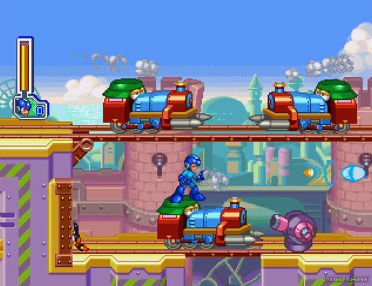

# Electricity - The Game

## Descrição
- `Gênero` Puzzle e Adventure game;
- `Tema` Lixão e Futurismo;
- `Câmera` Side-scrolling;
- `Estilo` 2D e Pixel Art;
- `Objetivo` Resolver os puzzles encontrados no caminho e derrotar os oponentes;

## Engine
- Unity 
- 2018.4.0f1
- C#

## Referências

- Mega Man VIII

- A Boy and His Blob

- Kirby & the Amazing Mirror

- Horizon Zero Dawn 

